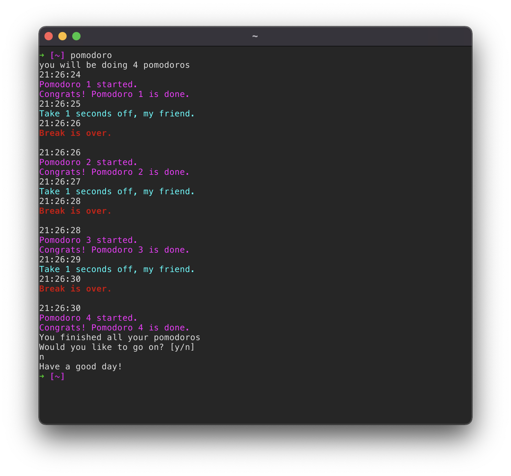

# POMODORO

An implementation of the pomodoro technique in bash.



## What is the Pomodoro Technique?

The Pomodoro Technique is a time management method developed by Francesco Cirillo in the late 1980s. The technique uses a timer to break down work into intervals, traditionally 25 minutes in length, separated by short breaks. Each interval is known as a pomodoro, from the Italian word for 'tomato', after the tomato-shaped kitchen timer that Cirillo used as a university student.

Source: [https://en.wikipedia.org/wiki/Pomodoro_Technique](https://en.wikipedia.org/wiki/Pomodoro_Technique)

## What this script does

After a certain time interval `pomodoro.sh` will open a browser and display an html file asking you to take a 5 minute break. After the break it will display another file, gently asking you to go back to work. Per default this happens four times in a row (2h in total). For reference these messages are also displayed in your console, with additional time stamps. No sounds are played, so this timer is perfectly suitable for use in quiet environments, e.g. libraries.

## Usage

```
pomodoro [options] [arguments]
```

## Options

```
-h, --help      Show a help message
-c, --custom    Start a wizzard to define number and length of the intervals
```

